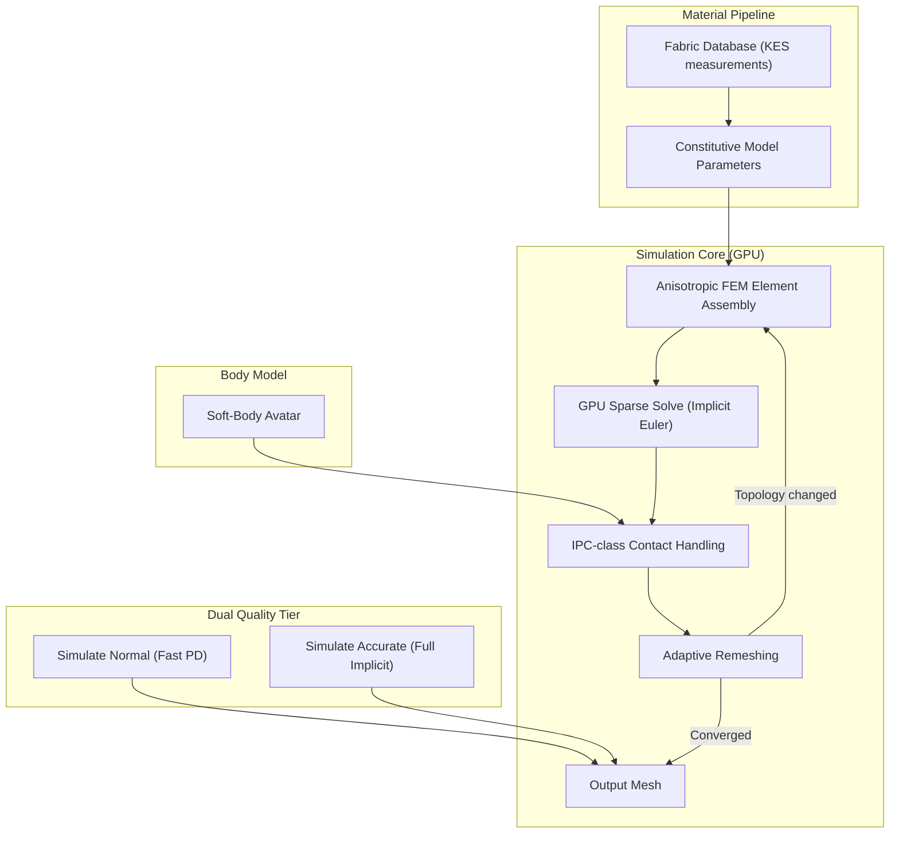
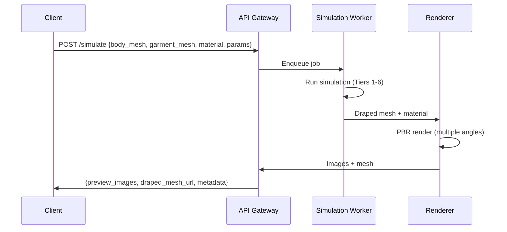
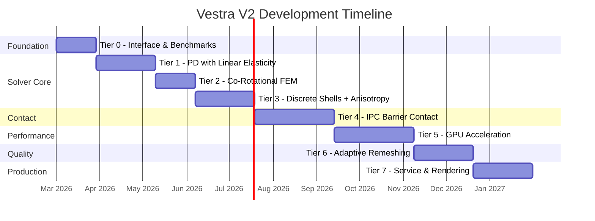

# Cloth Simulation: State of the Art & Incremental Development Plan

> A comprehensive technical analysis for building a production-grade, high-fidelity garment simulation engine — surveying every major paradigm, recent breakthroughs, and production architectures to inform an incremental strategy that achieves both realism and numerical robustness.

---

## Part I — The State of the Art

### 1. The Three Paradigms of Cloth Simulation

All cloth simulators ultimately solve the same problem: given a triangulated surface representing fabric, with known material properties and boundary conditions (body collision, gravity, pinning), compute how that surface deforms over time. The approaches differ in *how* they discretize the physics and *how* they solve the resulting equations.

---

#### 1.1 Force-Based / Implicit Integration (The "Classical" Path)

**Lineage:** Baraff & Witkin 1998 → Choi & Ko 2002 → Bridson et al. 2003 → ARCSim 2012 → C-IPC 2021

**Principle:** Model cloth as a continuous elastic sheet. Derive forces from a strain energy function defined over the deformation gradient of each triangle. Integrate these forces forward in time using an implicit scheme (Backward Euler), which requires solving a global linear system at each timestep.

**The Timestep Equation:**

At each step, we solve for the new velocity $\mathbf{v}^{n+1}$:

$$(\mathbf{M} - h^2 \frac{\partial \mathbf{f}}{\partial \mathbf{x}} - h \frac{\partial \mathbf{f}}{\partial \mathbf{v}}) \Delta \mathbf{v} = h(\mathbf{f}^n + h \frac{\partial \mathbf{f}}{\partial \mathbf{x}} \mathbf{v}^n)$$

Where $\mathbf{M}$ is the mass matrix, $\mathbf{f}$ is the total force vector, and $h$ is the timestep. The left-hand matrix is the *system matrix* — a large, sparse, symmetric positive-definite (SPD) matrix that changes every timestep because $\frac{\partial \mathbf{f}}{\partial \mathbf{x}}$ (the stiffness Jacobian) depends on the current deformation state.

**Solving the system:** The system is solved using preconditioned Conjugate Gradient (PCG). The quality of the preconditioner determines performance:
- **Diagonal (Jacobi):** Trivial, but poor convergence for stiff problems.
- **Incomplete Cholesky (IC):** Good convergence, moderate setup cost, hard to parallelize.
- **Algebraic Multigrid (AMG):** Excellent convergence, high setup cost, GPU implementations exist.
- **Domain Decomposition:** Split the mesh into overlapping patches, solve each locally, iterate globally. This is the approach of the SIGGRAPH 2025 domain-decomposed PD paper.

**Constitutive Models (What makes cloth "cloth"):**

| Model | Properties | Use Case |
|---|---|---|
| **St. Venant-Kirchhoff** | Linear stress-strain. Simple but breaks under compression (negative eigenvalues). | Prototyping only |
| **Co-Rotational** | Extracts rotation, applies linear elasticity in local frame. Handles large rotations. | General-purpose. Good default. |
| **Discrete Shells (Grinspun 2003)** | Bending energy based on dihedral angles between triangles. The curvature-based formulation is essential for realistic folds. | Bending model for any solver |
| **Anisotropic (Warp/Weft)** | Different stiffness along yarn directions. Uses a material tensor aligned to UV coordinates. | Realistic woven fabrics (cotton, denim, silk) |
| **Baraff-Witkin Stretch/Shear** | Condition-based strain formulation. Later analysis showed it approximates ARAP energy. Still widely used in production (VFX). | Production VFX |

**Why this matters for Vestra:** The force-based approach is the *only* path that directly connects simulation parameters to physically measurable fabric properties (Young's modulus, bending rigidity) obtained from standardized tests like the Kawabata Evaluation System (KES). If you want to simulate a specific real-world fabric — "this is 200gsm cotton twill" — you need the force-based formulation to map those measurements into your solver.

---

#### 1.2 Position-Based Dynamics (PBD / XPBD)

**Lineage:** Müller et al. 2007 (PBD) → Macklin et al. 2016 (XPBD) → Multi-Layer XPBD (SCA 2024)

**Principle:** Instead of computing forces and solving F=ma, directly move particle positions to satisfy geometric constraints. There is no global linear system. Each constraint is solved independently in a Gauss-Seidel loop.

**Vestra's current solver is XPBD.** You are intimately familiar with both its strengths and limitations from your engineering journey. The key limitations for your next-generation goals are:

1. **Convergence ceiling.** XPBD is mathematically equivalent to a block-coordinate descent on an implicit Euler objective. It converges to the implicit Euler solution only in the limit of infinite iterations. Your current 48 constraint solves per frame (6×8) is far from that limit.

2. **No true material model.** The compliance parameter $\alpha$ in XPBD is not equivalent to Young's modulus. You cannot take a Kawabata measurement and plug it directly into the solver. You must *tune by eye*.

3. **Order-dependent damping.** The Gauss-Seidel iteration introduces artificial dissipation that depends on the order in which constraints are processed. Graph coloring mitigates race conditions but does not eliminate the order-dependent energy loss.

4. **Wrinkle suppression.** With insufficient iterations, XPBD tends to "iron out" fine wrinkles because the constraint projection smooths high-frequency deformations. This is the fundamental reason why your cloth sometimes feels "too smooth" despite the mesh having sufficient resolution.

**Recent Advances in XPBD:**

- **Multi-Layer XPBD (SCA 2024):** Decomposes constraints into multiple "layers" solved in parallel, improving convergence rate without increasing iteration count. This is conceptually related to multigrid methods.
- **Houdini Vellum:** The most mature production XPBD system. Uses OpenCL for constraint solving, C++ for collision, VEX for material logic. It ships in a unified multi-solver supporting cloth, fluids, rigid bodies, and grains. Its quality demonstrates that XPBD *can* be production-grade for VFX, but Vellum's quality comes from extremely high iteration counts and sophisticated constraint architectures, not from the base PBD formulation alone.
- **Differentiable XPBD (2025):** Enables gradient-based learning of physical parameters from observed motion. This could allow automatic calibration of Vestra's parameters against real fabric video.

---

#### 1.3 Projective Dynamics (PD)

**Lineage:** Bouaziz et al. 2014 → Subspace PD (2023) → Domain-Decomposed PD (SIGGRAPH 2025)

**Principle:** Reformulate implicit Euler as an alternating minimization. Split the energy into a *global* quadratic term (mass + inertia) and *local* per-element terms (constitutive model). Alternate between:
1. **Local step:** Project each element to its closest valid configuration. Embarrassingly parallel — identical to PBD.
2. **Global step:** Solve a single global quadratic system. The system matrix $\mathbf{A} = \mathbf{M}/h^2 + \sum_i \mathbf{S}_i^T \mathbf{S}_i$ depends only on topology and masses — **not on deformation state.** It can be prefactored once.

**Why PD is the critical bridge:**

PD gives you the *convergence properties* of an implicit solver (global information propagation in each iteration) with the *per-element simplicity* of PBD (local step is trivially parallelizable). The constant system matrix means the expensive Cholesky factorization happens once (or after remeshing), and each subsequent global step is just a backsubstitution — $O(N)$ instead of $O(N^{1.5})$.

**Limitation: Linear elasticity.** The standard PD formulation assumes the local projections are onto convex sets, which restricts the constitutive model to (essentially) linear elasticity. Nonlinear materials like hyperelastic rubber require extensions. However, for cloth, the deformations are dominated by bending (geometric nonlinearity) rather than membrane stretching (material nonlinearity). Co-rotational projection handles the geometric nonlinearity nicely within the PD framework.

**Recent Breakthrough — Domain-Decomposed PD (SIGGRAPH 2025):**

This paper partitions the garment mesh into overlapping subdomains, prefactors each subdomain independently, and uses additive Schwarz iteration to converge the global solution. Key results:
- **CPU-only performance matching GPU methods.** The authors report performance comparable to state-of-the-art GPU methods on multi-core CPUs.
- **Near-linear scaling** with core count.
- **Applicable to your deployment model.** If you deploy as a service, you control the hardware. Multi-core CPU instances are cheaper and more available than GPU instances.

---

### 2. The Contact Revolution: IPC and Barrier Methods

Contact handling — preventing cloth from passing through the body or itself — has historically been the weakest link in cloth simulation. Traditional approaches (penalty forces, projection-based) are either too soft (allow interpenetration), too stiff (cause jitter), or too fragile (miss collisions entirely during fast motion).

#### 2.1 Incremental Potential Contact (IPC)

**Paper:** Li et al. 2020 (ACM TOG)

IPC reformulates contact handling as an energy minimization problem using logarithmic **barrier functions**. Instead of detecting and responding to collisions after they happen, IPC adds a smooth barrier potential:

$$b(d) = -(d - \hat{d})^2 \ln(d / \hat{d})$$

where $d$ is the distance between two primitives and $\hat{d}$ is the contact threshold. This barrier:
- Goes to $+\infty$ as $d \to 0$ (prevents interpenetration mathematically)
- Is $C^2$ continuous (smooth gradients for the optimizer)
- Has compact support (zero cost when primitives are far apart)

**Guarantee:** IPC provides a *mathematical certitude* that no interpenetration occurs during the simulation. This is not heuristic — the optimizer cannot accept a step that violates the barrier.

#### 2.2 Codimensional IPC (C-IPC)

**Paper:** Li, Kaufman, Jiang 2021 (SIGGRAPH)

C-IPC extends IPC to codimensional objects (shells, rods, particles). For cloth specifically:
- **Strain limiting as energy.** A $C^2$ cubic barrier enforces maximum stretch as an inequality constraint, eliminating the need for separate strain-limiting passes.
- **Thickness-aware contact.** Enforces minimum separation between mid-surfaces, capturing the physical thickness of fabric without inflating the mesh.
- **Additive CCD.** A new continuous collision detection method specifically designed for thin materials, where standard CCD can produce false negatives.

#### 2.3 Non-Distance Barriers (SIGGRAPH Asia 2024)

**Paper:** "Efficient GPU Cloth Simulation with Non-distance Barriers and Subspace Reuse"

This paper introduces a fundamentally different barrier concept: instead of measuring the Euclidean *distance* between primitives, it tracks the *virtual lifespan* of a collision event — how long a collision has been active. The barrier is computed based on this lifespan rather than geometric proximity.

**Key advantages:**
- **No CCD required per iteration.** CCD is the bottleneck of traditional IPC. Non-distance barriers avoid it entirely during the solve, only using CCD for line search.
- **GPU-native.** The non-distance barrier evaluation is fully parallelizable.
- **10× faster** than optimized IPC implementations while maintaining intersection-free guarantees.

Combined with **subspace reuse** — maintaining a coarse subspace decomposition that captures low-frequency deformations while the GPU iterative solver handles high-frequency detail — this represents the current state of the art for GPU cloth simulation performance.

#### 2.4 StiffGIPC (2024)

**Paper:** "StiffGIPC: Advancing GPU IPC for Stiff Affine-Deformable Simulation"

Co-authored by Minchen Li, this extends GPU IPC to handle stiff materials. Key innovations:
- **Connectivity-enhanced Multilevel Additive Schwarz preconditioner** on GPU — the first GPU-native preconditioner that respects mesh topology for better convergence on stiff systems.
- **$C^2$ cubic strain energy** for strain limiting in stiff membranes (directly applicable to cloth).
- **10× faster** than previous GPU IPC methods on stiff material benchmarks.

---

### 3. Adaptive Quality: Remeshing and Multi-Resolution

Fixed-resolution meshes are fundamentally limited. A 10,000-vertex shirt cannot capture a 0.5mm wrinkle, regardless of solver quality. The solution is **adaptive remeshing** — dynamically adding vertices where detail is needed and removing them where it isn't.

#### 3.1 ARCSim's Adaptive Anisotropic Remeshing

**Paper:** Narain, Samii, O'Brien 2012 (SIGGRAPH Asia)

ARCSim defines a **sizing field** — a metric tensor at each point on the surface — that specifies the target edge length in each direction. This tensor is computed from:
- **Surface curvature:** Smaller triangles in highly curved regions (wrinkles, folds).
- **Velocity gradient:** Smaller triangles where the surface is deforming rapidly (anticipates wrinkle formation).

The mesh is refined (edge splits), coarsened (edge collapses), and improved (edge flips) to match this sizing field. The remeshing is *anisotropic* — triangles can be long and thin along a wrinkle ridge, using minimal vertices while capturing the shape.

**Impact:** A flat region might have 100 triangles. The same region, when wrinkled, might have 10,000. The total vertex count for the garment dynamically adjusts between ~5,000 (resting) and ~100,000 (heavily wrinkled), concentrating computation exactly where it matters.

#### 3.2 Progressive Dynamics (SIGGRAPH 2024)

**Paper:** Zhang, James, Kaufman (Adobe Research)

Progressive Dynamics takes a *different* approach to multi-resolution. Instead of adaptive remeshing during simulation, it:
1. Simulates on a **coarse mesh** first (fast, predictive preview).
2. **Prolongs** (upsamples) the coarse solution onto a finer mesh.
3. Uses the prolonged result as initialization for a **fine simulation**.

The coarse simulation produces consistent previews at low cost. The fine simulation, initialized from the coarse solution, converges rapidly (fewer iterations needed because the initial state is already close). A follow-up, **Progressive Dynamics++**, adds stability improvements and user-controlled LOD balancing.

**Implication for Vestra:** Progressive Dynamics enables a *two-tier service* — return a fast preview (1-2 seconds) from the coarse mesh, then asynchronously compute and deliver the fine result (10-30 seconds). This matches the API service model you're planning.

#### 3.3 Volumetric Homogenization for Knitwear (SIGGRAPH Asia 2024)

This paper addresses knitted fabrics, which have fundamentally different mechanics from woven fabrics. Instead of simulating individual yarns (computationally intractable), it:
1. Simulates small yarn-level patches.
2. Homogenizes their behavior into a spatially varying continuum model.
3. Uses a novel **domain-decomposed subspace solver** on GPU, within the Projective Dynamics framework.

**Why it matters:** It demonstrates that the PD + domain-decomposed solver architecture can handle spatially varying, anisotropic materials — exactly what's needed for garment simulation where different parts of a garment may have different fabrics.

---

### 4. Production Engines: How the Leaders Do It

#### 4.1 Style3D — Reverse-Engineering the Architecture

Style3D does not publish its solver algorithms, but public information reveals a clear architectural picture:

| Capability | Technical Inference |
|---|---|
| "World-leading Deformable Body Simulation" | Custom FEM-class solver, likely implicit with GPU global solve |
| GPU solver, optimized for NVIDIA | CUDA-accelerated. Likely custom sparse solver, not just PD local step |
| 1M+ polygons, smooth simulation | Adaptive meshing with aggressive LOD culling. Subspace decomposition for solver. |
| "Simulate Accurate" vs "Simulate Normal" modes | Two solver tiers — high-iteration implicit (Accurate) and low-iteration PBD/PD (Normal) |
| "95% accuracy in drape and texture" | Calibrated against real fabric tests (Kawabata or equivalent). Physical material model. |
| Soft-body avatars | Deformable body collision — the body itself deforms under garment pressure (essential for tight fits) |
| 4K rendering at 60fps on mid-range GPU | Decoupled rendering from simulation. Simulation is pre-baked or GPU-concurrent. |
| Adaptive meshing reducing polygons by 40% | Runtime remeshing similar to ARCSim but integrated with GPU solver |

**The likely Style3D architecture:**

#### 4.2 CLO3D / Marvelous Designer

CLO3D shares CLO Virtual Fashion's proprietary solver. In 2024:
- **GPU simulation accuracy now matches CPU** (the fact this was a 2024 achievement implies they had different solver paths).
- **Soft-body simulation** for avatars.
- **Animation-stable GPU simulation** — stable enough for recording garment motion sequences.
- **NVIDIA-only GPU acceleration.**

CLO3D's solver is likely an implicit integration scheme (not PBD) based on:
- Their ability to match CPU and GPU results exactly (PBD is iteration-order-dependent, making GPU/CPU parity hard).
- Their "animation stable" qualifier — implicit methods are unconditionally stable by construction.

#### 4.3 Houdini Vellum

Houdini Vellum is the most transparent production solver:
- **XPBD core** with OpenCL GPU acceleration for constraints.
- **C++ collision handler** — collision is not on the GPU.
- **VEX scripting** for custom material logic — users can define custom constraint behavior.
- **Micro-solver architecture** — each system (integration, constraints, collision, post-processing) is a separate composable node.

Vellum demonstrates that XPBD *can* reach production quality for VFX, but it relies on:
- Very high iteration counts (often 100+)
- Sophisticated constraint architectures (long-range attachments, anisotropic bending, buckle stiffness)
- The full power of SideFX's collision engine

**Lesson for Vestra:** If you stay on XPBD, you need Vellum-class sophistication in your constraint architecture and collision system. That is a multi-year effort comparable to building a new solver from scratch.

---

### 5. The Differentiable Frontier

Differentiable simulation is the emerging paradigm that connects physics simulation to machine learning. It enables:

| Capability | How It Works |
|---|---|
| **Material Parameter Estimation** | Given a video of real fabric draping, optimize material parameters until the simulation matches the video. Gradient flows backward through the solver. |
| **Inverse Garment Design** | Given a desired draped shape, find the 2D pattern that produces it when simulated. |
| **Neural Cloth Models** | Train a neural network to approximate the simulator, enabling real-time inference at offline quality. |
| **Data-Driven Enhancement** | Fine-tune a physics solver's output using learned corrections from real-world data. |

**Key Papers:**

- **DiffCloth (MIT, 2022):** Differentiable cloth simulation based on Projective Dynamics with dry frictional contact. Demonstrates optimization of material parameters and garment shapes through gradient-based methods.
- **DiffCP (2023):** Uses an anisotropic elasto-plastic constitutive model to identify cloth physics parameters from real-world observations. Also improves cloth pose estimation.
- **NeuralClothSim (NeurIPS 2024):** Encodes surface deformation as a neural field. Overcomes discrete mesh limitations. Can query surface states at arbitrary resolution.
- **Bayesian Differentiable Physics (UCL, 2024):** Addresses material heterogeneity and stochasticity. Real fabrics are not perfectly uniform — this captures the statistical variation in material properties across a garment.
- **Inverse Garment and Pattern Modeling (2024):** Automatically adjusts 2D template patterns and material parameters to match a target 3D garment shape. This is the inverse of the simulation problem.

**Implications for Vestra V2:**

Differentiable simulation is the path to *automatic material calibration.* Instead of manually tuning fabric parameters, you could:
1. Film a real fabric swatch draping over a sphere.
2. Run the differentiable solver backward to find the material parameters that reproduce the observed draping.
3. Store those parameters in a material database.

This eliminates the "tune until it looks right" problem that plagues XPBD and makes your system reproducible and data-driven.

> [!IMPORTANT]
> Differentiable simulation requires that the solver itself is differentiable — meaning every operation must support backpropagation. PD-based solvers are naturally suited for this because the local-global split cleanly separates the differentiable (local projections) from the linear solve (implicit function theorem). XPBD's Gauss-Seidel iteration is harder to differentiate efficiently.

---

### 6. Fabric Measurement: The Physical Ground Truth

All simulation fidelity is ultimately meaningless without grounding in real fabric behavior. The **Kawabata Evaluation System (KES)** is the industry standard for measuring low-stress mechanical properties:

| KES Instrument | Property Measured | Simulation Mapping |
|---|---|---|
| **KES-FB1** (Tensile/Shear) | Extension, shear stiffness, hysteresis | Young's modulus, Poisson's ratio, shear modulus |
| **KES-FB2** (Bending) | Bending rigidity $(B)$, hysteresis $(2HB)$ | Bending stiffness in discrete shells model |
| **KES-FB3** (Compression) | Thickness, compressibility | Contact thickness, collision offset |
| **KES-FB4** (Surface) | Friction coefficient, roughness | Coulomb friction parameters |
| **Weight** | Areal density $(g/m^2)$ | Mass per vertex |

**The measurement-to-simulation pipeline:**

**Key insight:** KES measurements are taken at *low stress* — exactly the regime where cloth draping occurs. High-stress behavior (tearing, permanent deformation) requires different tests. For VTO purposes, KES provides sufficient characterization.

**Published databases:** The Korea Research Institute of Chemical Technology (KRICT) and several textile universities maintain databases of KES measurements for common fabrics. These can bootstrap your material library without requiring access to a KES machine.

---

## Part II — How Style3D Likely Achieves Its Quality

Synthesizing all available information, the Style3D architecture almost certainly combines:

### The Solver

1. **Full implicit integration** (not PBD/XPBD) as the primary solver for "Accurate" mode. The evidence: GPU/CPU parity, animation stability, direct mapping of KES measurements to simulation parameters.

2. **A fast PD-class solver** for "Normal/Preview" mode. The evidence: the dual-mode system, the fast preview workflow, the fact that PD with subspace reuse provides excellent quality at interactive rates.

3. **GPU-accelerated global solve** using a custom sparse solver optimized for cloth topology. The evidence: NVIDIA-only requirement, 1M+ polygon support, 60fps rendering at 4K.

### The Contact System

4. **IPC-class barrier method** (or an equivalent proprietary barrier approach). The evidence: their claim of zero interpenetration, the stability under multi-layer garment scenarios, the soft-body avatar deformation.

5. **Deformable body collision.** The avatar body is not rigid — it deforms slightly under garment pressure. This is essential for tight-fitting garments (jeans, leggings) where the body surface needs to yield slightly to prevent unphysical contact artifacts.

### The Mesh Management

6. **Adaptive meshing** that reduces polygon count by ~40% in flat regions while increasing it in wrinkled regions. The evidence: their published "up to 40% polygon reduction" claim, the visual quality of wrinkle details.

### The Material System

7. **Calibrated against real fabric tests.** The "95% accuracy" claim is meaningless without a physical reference. They almost certainly have a Kawabata-derived or equivalent material database. Their "extensive and professional fabric presets" confirm this.

### What Would It Take to Match or Surpass Style3D?

| Style3D Capability | What We Need | Difficulty |
|---|---|---|
| Accurate implicit solver | PD with co-rotational FEM + anisotropic extensions | **Achievable** (well-documented in literature) |
| GPU acceleration | CUDA or Vulkan Compute for local step + sparse solve | **Achievable** (reference implementations exist) |
| IPC-class contact | Implement non-distance barriers (SIGGRAPH Asia 2024) | **Hard** (cutting-edge, but paper is detailed) |
| Adaptive remeshing | Port ARCSim's BSD-licensed remeshing | **Moderate** (well-documented, BSD code available) |
| Material database | Build from published KES data + differentiable calibration | **Moderate** (data exists, DiffCloth gives the pipeline) |
| Soft-body avatars | LiDAR body model with deformable collision | **Hard** (requires coupling body deformation with cloth solver) |
| Dual-quality tiers | Run PD at low iterations for preview, full implicit for final | **Easy** (same solver, different iteration count) |

---

## Part III — The Incremental Development Plan

### Design Principles

1. **Each tier must produce a working, testable system.** No tier should take more than 6-8 weeks. Each tier delivers a measurable quality improvement over the previous.

2. **Start with the solver core, not the periphery.** The solver determines the quality ceiling. Collision, remeshing, and materials can be layered on top.

3. **Test against physical reference.** At every tier, compare against known drape benchmarks (a square cloth falling on a sphere, a tablecloth on a table) to objectively measure quality.

4. **Keep Vestra V1 alive.** The existing XPBD engine continues to serve as the interactive web demo. V2 is a separate, headless engine that shares no code with V1 but may share data formats.

---

### Tier 0 — Foundation & Interface Contract

**Goal:** Define the I/O boundary and validation infrastructure before writing any solver code.

**Deliverables:**
- **Simulation Interface:** Define the input/output contract. Input: body mesh + garment mesh + material parameters + gravity/boundary conditions. Output: final draped garment mesh + per-vertex metadata (strain, contact forces).
- **Benchmark Suite:** Implement the three canonical drape tests from the cloth simulation literature:
  - **Hanging Cloth:** A square cloth pinned at two corners. Validates gravity + distance constraints.
  - **Sphere Drape:** A square cloth falling onto a sphere. Validates collision + draping.
  - **Self-Fold:** A cloth folded in half and dropped. Validates self-collision.
- **Visual Validator:** A simple offline renderer (headless Three.js or Filament) that produces images of the benchmark results for side-by-side comparison.
- **Measurement Framework:** Implement tools to measure:
  - Vertex count over time (for later remeshing validation)
  - Energy conservation (total kinetic + potential + elastic energy)
  - Penetration depth (maximum signed distance of cloth vertices below body surface)
  - Strain (maximum triangle stretch ratio)

**Language decision:** This is the point to decide between Rust (leveraging team expertise) and C++ (leveraging ecosystem). The recommendation:

| Factor | Rust | C++ |
|---|---|---|
| Team familiarity | ★★★★★ | ★★☆☆☆ |
| GPU compute | wgpu (Vulkan/Metal/DX12) | CUDA (NVIDIA only) or Vulkan |
| Sparse linear algebra | nalgebra-sparse, faer | Eigen, SuiteSparse (CHOLMOD) |
| Ecosystem maturity | Growing but thin for HPC | Deep and battle-tested |
| Safety | Memory-safe | Manual memory management |
| Interop with ARCSim (C++) | FFI required | Native |

> [!TIP]
> **Recommended: Rust core with C FFI to CHOLMOD/SuiteSparse for the global solve.** This preserves team expertise while accessing the most battle-tested sparse solver available. The local step and collision are implemented in Rust. The global solve calls CHOLMOD through FFI. When GPU acceleration comes (Tier 5), the local step moves to wgpu compute, and the global solve can use either GPU CHOLMOD (cuSPARSE) or remain CPU-side with minimal performance impact (the global solve is $O(N)$ after prefactoring).

---

### Tier 1 — Minimal Viable Solver: Projective Dynamics with Linear Elasticity

**Goal:** Replace the XPBD constraint loop with a Projective Dynamics local-global solver. Prove that PD delivers higher quality than XPBD at equivalent iterations.

**What changes:**
- **Integration:** Backward Euler formulated as PD local-global.
- **Membrane model:** Linear elasticity (St. Venant-Kirchhoff). Simple, fast, good enough for initial validation.
- **Bending model:** Dihedral angle springs (same as Vestra V1 initially — upgrade in Tier 3).
- **System solve:** Sparse Cholesky via CHOLMOD. Prefactored once at initialization. Backsubstitution per iteration.
- **Collision:** Keep the existing spatial hash + position correction from Vestra V1. Just transplant it.
- **Self-collision:** Same as V1 (spatial hash + graph-colored resolution).

**What stays the same from V1:**
- Spatial hash data structures
- Graph coloring for self-collision
- Basic collision response logic

**Expected outcome:**
- **Quality:** Noticeably stiffer fabric at fewer iterations. Where V1 needed 48 constraint solves (6 substeps × 8 iterations), PD should achieve equivalent or better stiffness with 10-15 PD iterations — because each PD iteration propagates information globally through the prefactored system.
- **Performance:** Slower per-iteration (due to global solve), but fewer iterations needed. Net performance approximately equal to V1 on the same mesh.

**Validation:**
- Run the Hanging Cloth benchmark with both V1 (XPBD) and Tier 1 (PD) at matched iteration counts. PD should produce less vertical elongation (lower stretch error).
- Measure energy conservation. PD should show less artificial damping.

**Risk:** CHOLMOD FFI integration and sparse matrix assembly. Mitigated by the well-documented nalgebra-sparse and the sprs crate in Rust.

---

### Tier 2 — Co-Rotational FEM Membrane Model

**Goal:** Replace the linear elasticity with co-rotational FEM, allowing the solver to handle large rotations (which are ubiquitous in cloth deformation — every fold is a large rotation).

**What changes:**
- **Per-triangle computation:** Compute the deformation gradient $\mathbf{F}$ for each triangle relative to its rest state. Perform a polar decomposition $\mathbf{F} = \mathbf{R}\mathbf{S}$ to extract the rotation $\mathbf{R}$. Apply linear elasticity in the rotated frame.
- **Local step update:** The PD local step now projects each triangle to its closest co-rotated configuration instead of its rest state.
- **Anisotropy preparation:** Structure the constitutive model to accept a per-triangle material tensor (identity for now; will be populated with warp/weft data in Tier 3).

**What stays the same:** Global solve prefactoring, collision, self-collision.

**Expected outcome:**
- **Quality:** Dramatically improved fold behavior. Linear elasticity produces energy artifacts when triangles rotate significantly (folded cloth). Co-rotational eliminates these artifacts.
- **Performance:** Marginal increase per iteration (polar decomposition per triangle). Still far less than rebuilding a full stiffness matrix.

**Validation:**
- Self-Fold benchmark: The fold line should be crisp and stable. With linear elasticity, it tends to be soft or oscillatory.
- Compare fold shapes against ARCSim reference images from the 2012 paper.

---

### Tier 3 — Discrete Shell Bending + Anisotropic Materials

**Goal:** Upgrade bending to the state-of-the-art curvature model and introduce anisotropic material behavior.

**What changes:**

**Bending:**
- Replace dihedral-angle springs with **Discrete Shells** (Grinspun et al. 2003). This formulates bending energy in terms of the *curvature difference* between current and rest configurations, not the angle difference.
- Curvature-based bending is essential for realistic fold behavior: folds are sharper where the curvature is high (edges, creases) and smoother where it's low (broad drapes).

**Anisotropy:**
- Implement a **warp/weft material tensor** aligned to the garment's UV coordinates. This encodes different stiffness along the warp (vertical) and weft (horizontal) yarn directions.
- Map KES-FB1 tensile measurements to the warp/weft stiffness components.
- Map KES-FB2 bending rigidity to the discrete shell bending stiffness, separately for warp and weft directions.

**Material presets:**
Create an initial material library from published fabric data:

| Material | Areal Density | Stretch Stiffness (Warp/Weft) | Bending Rigidity | Friction |
|---|---|---|---|---|
| Cotton Twill (200gsm) | 200 g/m² | High / High | Medium | 0.5 |
| Silk Charmeuse | 80 g/m² | Low / Low | Very Low | 0.3 |
| Denim (14oz) | 400 g/m² | Very High / High | High | 0.6 |
| Jersey Knit | 180 g/m² | Low / Medium | Low | 0.4 |
| Chiffon | 50 g/m² | Low / Low | Very Low | 0.2 |

**Expected outcome:**
- Cotton should drape differently from silk. Denim should hold its shape; chiffon should flow.
- Bias-cut garments (45° to the grain) should stretch more than straight-grain garments — a classic test of anisotropic behavior.

**Validation:**
- Compare simulated drape profiles against published KES-correlated drape test data.
- Visual comparison: silk vs. denim drape on the same garment shape.

---

### Tier 4 — Robust Contact: IPC-Class Barrier Method

**Goal:** Replace the heuristic collision system (spatial hash + position projection) with a barrier-based contact method that provides mathematical guarantees of intersection-free simulation.

This is the most technically challenging tier. There are two implementation paths:

**Path A: Non-Distance Barriers (SIGGRAPH Asia 2024)**

Advantages:
- GPU-native design
- No per-iteration CCD (only for line search)
- 10× faster than standard IPC
- Designed specifically for cloth

Disadvantages:
- Very recent paper — fewer reference implementations
- Requires integrating a line-search mechanism into the PD solver

**Path B: Classical IPC with C-IPC Extensions**

Advantages:
- More mature, better documented
- Reference implementations available
- Battle-tested in production

Disadvantages:
- CCD per iteration is expensive
- Harder to GPU-accelerate efficiently

**Recommendation:** Start with **Path B (classical IPC)** for correctness, then optimize with non-distance barrier ideas once the contact system is validated. The IPC contact energy is an additive term — it slots into the PD framework as an additional local projection.

**What changes:**
- **Broad phase:** Replace spatial hash with a **Bounding Volume Hierarchy (BVH)**. BVHs provide guaranteed $O(N \log N)$ query complexity and can be built using Linear BVH (LBVH) algorithms on the GPU.
- **Narrow phase:** Implement vertex-triangle and edge-edge distance primitives with numerically robust coplanarity checks.
- **Barrier energy:** Add the logarithmic barrier function as an additional energy term in the PD objective.
- **Line search:** Add an Armijo line search to each PD iteration to ensure the barrier is not violated by overshooting.
- **CCD for step validation:** After each solve, verify no intersections were created using swept-volume CCD.

**System matrix impact:** Adding barrier forces changes the system matrix (it's no longer constant). Two options:
1. **Penalty approach:** Approximate the barrier with a penalty force and absorb it into the constant system matrix. Simple but less accurate.
2. **Augmented Lagrangian:** Treat contacts via an outer augmented Lagrangian loop around the PD inner loop. Preserves the constant system matrix. Better accuracy.

**Expected outcome:**
- Zero interpenetration in all benchmark scenarios, including stress tests (fast-moving body, tight garments).
- Elimination of the "floating" and "tunneling" artifacts that plague penalty-based collision.

**Validation:**
- Stress test: Drop a garment onto a rapidly moving body. No vertex should ever cross the body surface.
- Tight fit: Simulate an XS garment on an L body. The garment should compress against the body without any vertices penetrating.
- Self-collision: Simulate a full skirt spinning. No self-intersection should occur.

**Risk:** This is the highest-risk tier. CCD implementations are notorious for numerical edge cases. Mitigation: use the `Tight Inclusion` library (open source, BSD, gold-standard CCD) for narrow-phase.

---

### Tier 5 — GPU Acceleration

**Goal:** Port the computationally expensive per-element operations to GPU compute while keeping orchestration and topology-changing operations on CPU.

**GPU-side (parallel, per-element):**
- Force assembly (per-triangle FEM computation)
- Local step projections
- BVH traversal and narrow-phase distance computation
- Barrier force evaluation
- Self-collision spatial hash query + response

**CPU-side (sequential, topology-aware):**
- Simulation orchestration and timestep control
- Sparse Cholesky factorization (when topology changes)
- Cholesky backsubstitution (can also be GPU-accelerated via cuSPARSE if using CUDA)
- Adaptive remeshing (Tier 6)
- Convergence checking

**Technology choice:**
- **wgpu (Rust):** Cross-platform (Vulkan, Metal, DX12). Write compute shaders in WGSL. No NVIDIA lock-in. This is the recommended path given the Rust codebase.
- **CUDA (C/C++ FFI):** NVIDIA-only but maximum performance and ecosystem support (cuSPARSE, Thrust, CUB).

**Data layout on GPU:**
- **Structure of Arrays (SoA):** Positions as three separate `f32[]` arrays (X, Y, Z). Essential for coalesced GPU memory access.
- **Pinned host memory:** Use pinned (page-locked) host memory for CPU-GPU transfers to minimize latency.
- **Persistent GPU buffers:** Allocate all simulation buffers on the GPU at initialization. Only transfer the final result back to CPU.

**Expected outcome:**
- 5-20× speedup over CPU-only Tier 4.
- Ability to simulate 50,000+ vertex garments at acceptable throughput for a service (< 30 seconds for a full drape).

---

### Tier 6 — Adaptive Anisotropic Remeshing

**Goal:** Implement dynamic mesh refinement and coarsening to capture wrinkle detail without prohibitive vertex counts.

**Why Tier 6 and not earlier?** Remeshing changes mesh topology, which invalidates the prefactored system matrix and requires careful state transfer (positions, velocities, material assignments) to the new mesh. It's easier to build this on top of a working and validated solver than to build it simultaneously.

**Implementation:**

1. **Sizing field computation:** At each frame (or every N frames), compute a metric tensor at each vertex based on:
   - Principal curvatures (from the current mesh shape)
   - Velocity gradient (from the change in position over the last few frames)
   - A user-specified minimum/maximum edge length

2. **Remeshing operations:**
   - **Edge split:** If an edge is longer than the sizing field specifies, split it at the midpoint.
   - **Edge collapse:** If an edge is shorter than the sizing field specifies, collapse it (merge endpoints).
   - **Edge flip:** If flipping an edge improves triangle quality (Delaunay criterion in the sizing metric), flip it.

3. **State transfer:** When a vertex is added (split), interpolate its position, velocity, and material properties from the parent edge endpoints. When a vertex is removed (collapse), discard its state.

4. **System matrix refactorization:** After remeshing, rebuild and refactorize the PD system matrix. The cost is $O(N^{1.5})$ but happens only when the mesh changes (typically every 5-10 frames, or less frequently once the mesh stabilizes).

**Port from ARCSim:** ARCSim's remeshing code is BSD-licensed C++. It can be:
- Directly called from Rust via FFI.
- Or ported to Rust for tighter integration.

The remeshing logic is well-isolated (~2,000 lines of C++) and has been validated over a decade of use.

**Expected outcome:**
- Dramatic improvement in wrinkle detail without increasing average vertex count.
- Dynamic vertex count: ~5,000 at rest → ~30,000-80,000 under heavy wrinkling.
- Wrinkle resolution comparable to ARCSim / Style3D quality.

---

### Tier 7 — Service API, Rendering, and Production Hardening

**Goal:** Package the engine as a deployable service with high-fidelity rendering output.

**Service API:**

**Rendering pipeline:**
- Use a headless PBR renderer (Filament by Google, Apache 2.0, or Blender Cycles, GPL).
- Fabric-specific BSDF: Irawan-Marschner model for woven fabrics, capturing yarn-level scattering effects.
- Multi-angle output: front, back, left, right, detail crop.

**Production hardening:**
- **Timeout & fallback:** If the simulation doesn't converge within a time limit, return the best-effort result with a quality flag.
- **Input validation:** Reject non-manifold meshes, degenerate triangles, zero-area garments.
- **Queue management:** Use a job queue (Redis/RabbitMQ) to handle concurrent simulation requests.
- **Telemetry:** Log timestep count, iteration count, penetration depth, strain energy for every simulation. Build a quality dashboard.

---

## Part IV — Risk Register & Mitigation

| Risk | Tier | Severity | Mitigation |
|---|---|---|---|
| CHOLMOD FFI complexity | 1 | Medium | Use the `suitesparse-sys` Rust crate. Test with small matrices first. Fallback: `faer` crate (pure Rust sparse Cholesky). |
| Co-rotational polar decomposition instability | 2 | Low | Well-understood numerics. Use SVD fallback for degenerate triangles ($\det(\mathbf{F}) < \epsilon$). |
| Anisotropic model parameter sensitivity | 3 | Medium | Start with isotropic (warp = weft) and gradually introduce difference. Validate against KES data for each step. |
| CCD false negatives | 4 | High | Use `Tight Inclusion` library (provably correct CCD). Fuzz-test with randomized mesh configurations. |
| IPC barrier stiffness explosion near contact | 4 | Medium | Use $\hat{d}$-based capping. C-IPC's thickness-aware formulation prevents infinitely thin gaps. |
| GPU compute shader debugging | 5 | High | Implement CPU reference solver that produces bit-exact results. Compare GPU output against CPU reference for every kernel. |
| Remeshing topology corruption | 6 | High | Port ARCSim's tested code directly. Add manifold verification (genus check, Euler's formula $V - E + F = 2$) after every remeshing pass. |
| Service cold-start latency | 7 | Low | Pre-warm GPU contexts. Keep simulation instances alive in a pool. |
| Soft-body avatar coupling complexity | Future | High | Defer to post-Tier 7. Use rigid body collision initially. Soft-body is an enhancement, not a requirement for V1 service launch. |

---

## Part V — Summary: What We Build, What We Borrow, What We Defer

### Build From Scratch
- Projective Dynamics solver core (Tier 1-2)
- Anisotropic material model integration (Tier 3)
- GPU compute kernel pipeline (Tier 5)
- Service API and production infrastructure (Tier 7)

### Borrow / Port (BSD-Licensed)
- **ARCSim adaptive remeshing** (Tier 6) — the single highest-impact borrowed component
- **CHOLMOD/SuiteSparse** sparse Cholesky solver (Tier 1) — decades of battle-testing
- **Tight Inclusion** CCD library (Tier 4) — provably correct collision detection

### Defer to Future Work
- Soft-body avatar deformation
- Multi-garment layering
- Differentiable simulation for automatic material calibration
- NeuralClothSim-class learned models for real-time inference
- Volumetric knitwear homogenization
- Progressive Dynamics for dual-tier preview/final output

### The Critical Path

**Total estimated timeline:** ~48 weeks (12 months) from Tier 0 to Tier 7. This is aggressive but achievable for a focused small team, because each tier builds directly on the previous one, and the most complex algorithms (remeshing, CCD) are borrowed from well-tested open-source implementations rather than built from scratch.

The engine that emerges from Tier 7 would be architecturally competitive with Style3D's solver while being fully owned, customizable, and deployable as an independent service.
